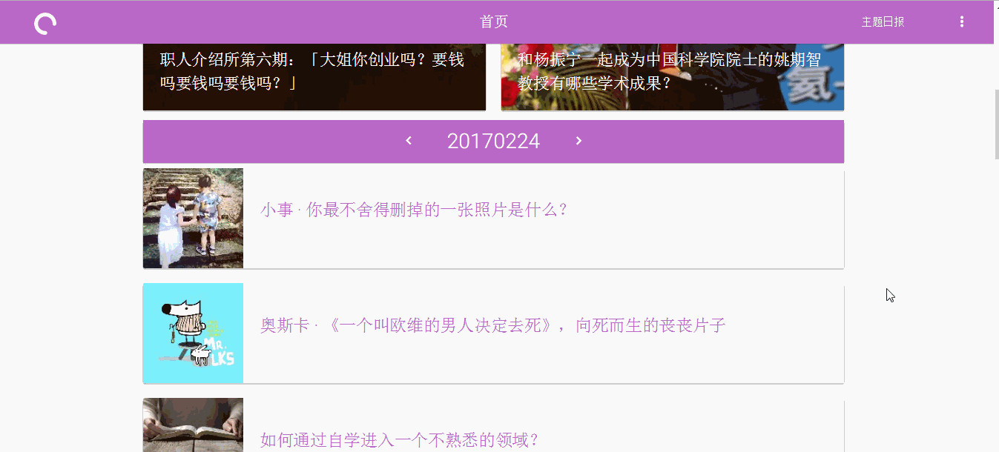
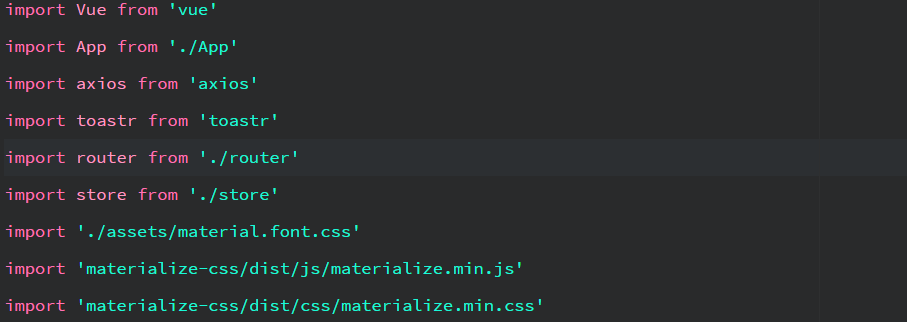
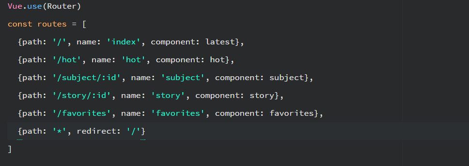

# 一款简洁美观的web版知乎日报

## 效果图
首页

查看文章

主题日报

收藏文章

热门文章

首页切换日期
   

## 简介

一个适合用来学习(Vuejs)[https://cn.vuejs.org/]的小项目, 纯前端项目, 使用(vue-router)[https://router.vuejs.org/]做前端路由跳转, 结合(vuex)[https://vuex.vuejs.org/]和localStroage开发了收藏功能, 使用(axios)[https://github.com/mzabriskie/axios]进行资源请求.

在页面里使用[watch](https://cn.vuejs.org/v2/api/#watch)来监听需要改变的值, [filter](https://cn.vuejs.org/v2/guide/syntax.html#Filters)将值格式化成需要格式.


## 开发流程

首先使用vue-cli按提示创建好项目, 然后依自己需要安装依赖, 选择了我觉得挺好

看的[Materialize](http://materializecss.com/)作为UI框架, 还有[toastr](https://github.com/CodeSeven/toastr),

 一个弹出toast的库, 然后参考了[Gallery](https://themes.materializecss.com/pages/demo)和

 [colorhurt](http://colorhunt.co/), 这两个网站的风格, 搭建页面.

```bash
npm install materialize-css toastr --save
```

安装完全部依赖, 删除不需要的文件.

因为跨域的原因, 对config/index.js里面的proxyTable进行设置, 为了开发的时候方便获取数据, 详细内容参考[文档](https://vuejs-templates.github.io/webpack/proxy.html).
```javascript
proxyTable: {
  '/api': {
    target: 'http://news-at.zhihu.com',
    changeOrigin: true
  }
},
```

在src/main导入需要的文件


添加几个需要的组件, 顶部导航栏compoments/navbar, 主要功能是导航, 和显示路由的位置;
页脚compoments/footer, 显示网站信息; 首页compoments/latest, 显示知乎日报的最新消息; 查看文章页面compoments/story, 查看选中的文章, 和文章评论; 显示主题日报页面compoments/sunject, 查看不同的主题信息;
显示已收藏文章的页面, 查看自己收藏的文章页面.

然后配置前端路由, 将组件引入到router/index里面, 为每个路由加上name字段, 方便在组件里调用,

因为不管是文章页还是主题页都有唯一的参数id, 使用这个参数方便跳转, 和跳转之后利用id进行资源请求.

```javascript
<router-link :to="{name: 'name', params: { id: 1234 }}">link</router-link>
```


最后使用webpack打包成静态资源./dist, 这样就可以用后端服务器来运行项目了.


## 结语
使用Vuejs等框架几乎不再需要进行DOM操作, 而且开发的时候感觉更有条理, 出现问题容易知道问题出在哪里.
同时约束性更高, 代码有一定的格式, 以前使用jQuery的话很容易写出一长条的代码, 出错了也不好修改.

## Build Setup

``` bash
# install dependencies
npm install

# serve with hot reload at localhost:8080
npm run dev

# build for production with minification
npm run build

# build for production and view the bundle analyzer report
npm run build --report

# webpack打包后使用http-server后端快速启动项目
npm run start
```
## 知乎日报API

感谢[知乎日报 API 分析](https://github.com/izzyleung/ZhihuDailyPurify/wiki/%E7%9F%A5%E4%B9%8E%E6%97%A5%E6%8A%A5-API-%E5%88%86%E6%9E%90)提供的接口

written by [xrr2016](https://github.com/xrr2016),欢迎issue,fork,star.
