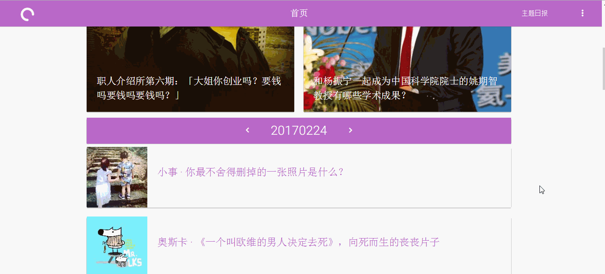
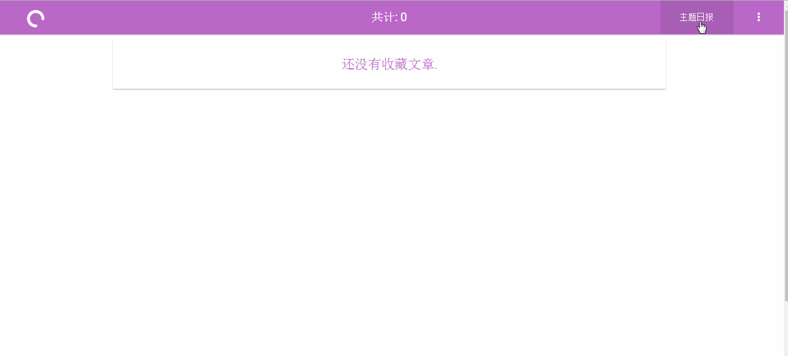
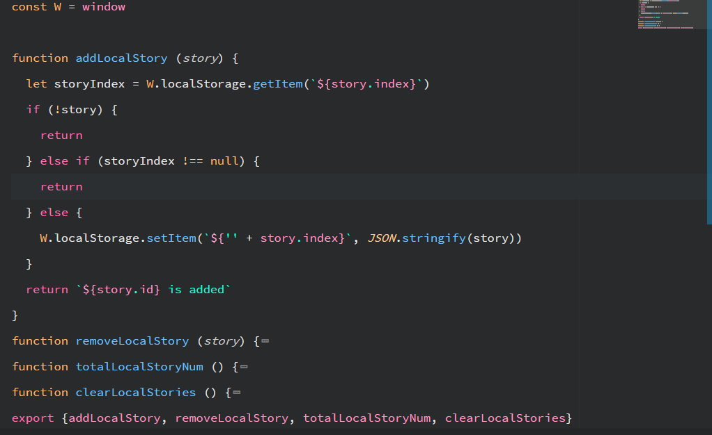
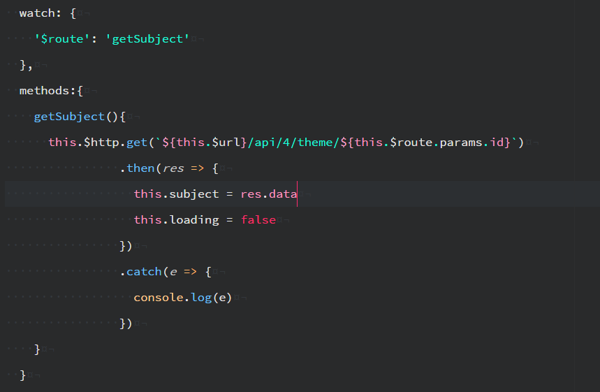

# 一款简洁美观的知乎日报

轻松查看知乎日报内容, 收藏你喜欢的文章

## 效果图
首页

查看文章

主题日报

收藏文章

热门文章

首页切换日期
   

## 简介

一个适合用来学习[Vuejs](https://cn.vuejs.org/)的小项目, 纯前端项目, 使用[vue-router](https://router.vuejs.org/)做前端路由跳转, 结合[vuex}(https://vuex.vuejs.org/)和localStroage开发了收藏功能, 使用[axios](https://github.com/mzabriskie/axios)进行资源请求.

在页面里使用[watch](https://cn.vuejs.org/v2/api/#watch)来监听需要改变的值, [filter](https://cn.vuejs.org/v2/guide/syntax.html#Filters)将值格式化成需要格式.


## 开发流程

首先使用vue-cli按提示创建好项目, 然后依自己需要安装依赖, 选择了我觉得挺好

看的[Materialize](http://materializecss.com/)作为UI框架, 还有[toastr](https://github.com/CodeSeven/toastr),

 一个弹出toast的库, 然后参考了[Gallery](https://themes.materializecss.com/pages/demo)和

 [colorhurt](http://colorhunt.co/), 这两个网站的风格, 搭建页面.

```bash
npm install materialize-css toastr --save
```

安装完全部依赖, 删除不需要的文件.

因为跨域的原因, 对config/index.js里面的proxyTable进行设置, 为了开发的时候方便获取数据, 详细内容参考[文档](https://vuejs-templates.github.io/webpack/proxy.html).

```javascript
proxyTable: {
  '/api': {
    target: 'http://news-at.zhihu.com',
    changeOrigin: true
  }
},
```

在src/main导入需要的文件


添加几个需要的组件, 顶部导航栏compoments/navbar, 主要功能是导航, 和显示路由的位置;
页脚compoments/footer, 显示网站信息; 首页compoments/latest, 显示知乎日报的最新消息; 查看文章页面compoments/story, 查看选中的文章, 和文章评论; 显示主题日报页面compoments/sunject, 查看不同的主题信息;
显示已收藏文章的页面, 查看自己收藏的文章页面.

然后配置前端路由, 将组件引入到router/index里面, 为每个路由加上name字段, 方便在组件里调用,

因为不管是文章页还是主题页都有唯一的参数id, 使用这个参数方便跳转, 和跳转之后利用id进行资源请求.

```javascript
<router-link :to="{name: 'name', params: { id: 1234 }}">link</router-link>
```

然后将router-view放到App.vue里面.

```javascript
<div id="app" class="row">
  <app-navbar></app-navbar>
  <router-view></router-view>
  <app-footer></app-footer>
</div>
```

路由配置完后, 应用[localStorage](https://developer.mozilla.org/en-US/docs/Web/API/Storage/LocalStorage)来开发收藏文章的功能. 就是将文章的内容存储到本地, 这样就可以在没网络的时候看文章了. [localStore.js](./src/store/localStore.js)

主要有

addLocalStory, 添加一个文章;
removeLocalStory, 删除一个文章;
totalLocalStoryNum, 返回收藏的文章总数;
clearLocalStories, 清除全部收藏文章;



有了这几个方法就可以对收藏的文章进行管理.

接下来完成组件部分, 对照[materialize](http://materializecss.com/)的文档写好页面,
这里是花时间最多的地方, 布一个好看的界面十分困难, 改来改去还是有不满意的地方, 使用[Grid](http://materializecss.com/grid.html)布局, 加上需要的元素, 其他几个组件同理, 不在赘述.

需要注意的是, 知乎日报的API返回的文章页面是一个包含html的字符串, 使用v-html渲染到页面上, 但是没有css文件, 解决的方法是将知乎日报文章页面的css文件(请求单个文章时会获得文章页css文件的url)保存到src/assets目录里面, 然后在story.vue里面导入

```
@import "../assets/zhihu.daily.css";
```

另一个问题是文章内的图片打不开, 解决的方法是在每张图片的src前面加上[Images.weserv](https://images.weserv.nl)的前缀, 应用Vuejs的filter完成.

页面基本写好, 把请求到的数据放上去后, 就基本完成了,然而发现在导航栏切换主题日报的时候,
主题页页面不更新, ajax请求也没发送, 虽然路由变了, 解决方法是使用
Vuejs的watch来监听路由的变化, 一旦路由的值变了, 就发送一个新的请求来获取数据, 同理还有首页里的日期值变化.



基本完成, 将组件内请求数据的url换成真实的地址.
最后使用webpack打包成静态资源./dist, 这样就可以用后端服务器来运行项目了.

## 结语

使用Vuejs等框架几乎不再需要进行DOM操作, 而且开发的时候感觉更有条理, 出现问题容易知道问题出在哪里.
同时约束性更高, 代码有一定的格式, 以前使用jQuery的话很容易写出一长条的代码, 出错了也不好修改.

ps: 目前我在找工作中, 求推荐一些比较新的前端开发面试题目, 谢谢.

## Build Setup

``` bash
# install dependencies
npm install

# serve with hot reload at localhost:8080
npm run dev

# build for production with minification
npm run build

# build for production and view the bundle analyzer report
npm run build --report

# webpack打包后使用http-server后端快速启动项目
npm run start
```
## 知乎日报API

感谢[知乎日报 API 分析](https://github.com/izzyleung/ZhihuDailyPurify/wiki/%E7%9F%A5%E4%B9%8E%E6%97%A5%E6%8A%A5-API-%E5%88%86%E6%9E%90)提供的接口

written by [xrr2016](https://github.com/xrr2016),欢迎issue,fork,star.
